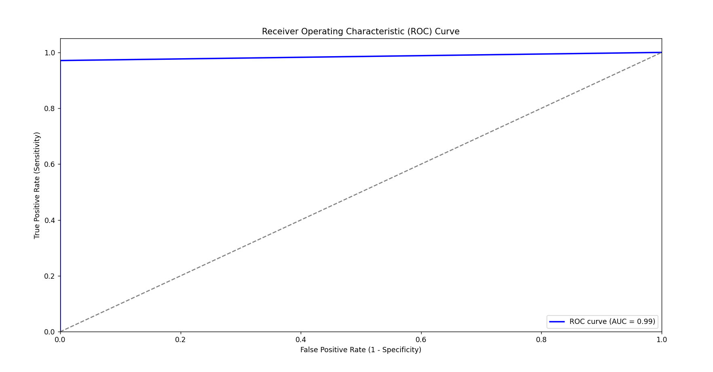

Sure, here's a structured `README.md` file tailored for your Disease Prediction Model repository on GitHub:

---

# Disease Prediction Model

This project implements a machine learning model to predict the likelihood of a disease based on medical data such as symptoms and patient history.

## Table of Contents

- [Introduction](#introduction)
- [Features](#features)
- [Dataset](#dataset)
- [Installation](#installation)
- [Usage](#usage)
- [Model Evaluation](#model-evaluation)
- [Results](#results)
- [Contributing](#contributing)
- [License](#license)

## Introduction

This repository contains a Python implementation of a disease prediction model using machine learning algorithms. The model is trained on a dataset containing labeled medical records, where each record consists of various features related to a patient's health condition. The goal is to predict whether a patient is likely to have a specific disease based on their symptoms and medical history.

## Features

- **Data Preprocessing:** Includes steps for cleaning and transforming the dataset to prepare it for machine learning models.
  
- **Model Selection:** Implements classification algorithms such as Decision Trees to train and evaluate the predictive model.
  
- **Evaluation Metrics:** Computes and visualizes metrics such as accuracy, precision, recall, F1-score, ROC curves, and confusion matrices to assess model performance.

## Dataset

The dataset (`heart.csv`) used for training and testing the model is sourced from [Kaggle](https://www.kaggle.com/ronitf/heart-disease-uci). It contains various attributes such as age, sex, cholesterol levels, and other medical parameters that are used as input features for disease prediction.

## Installation

To run the project locally, follow these steps:

1. Clone the repository:

   ```bash
   git clone https://github.com/SimranRojia/disease_prediction_model.git
   cd disease_prediction_model
   ```

2.Install dependencies:

   ```bash
   pip install -r requirements.txt
   ```

   Make sure you have Python 3.x and pip installed on your system.

## Usage

1. Data Preparation:

   Place your dataset (`heart.csv`) in the project directory or specify the path in the code.

2. Training the Model:

   Run the Python script to train the disease prediction model:

   bash
   python main.py
   


4. Visualization:

   View visualizations of evaluation metrics and model performance, including ROC curves and confusion matrices.
   

## Model Evaluation

The model is evaluated using various metrics to assess its accuracy and reliability in predicting disease likelihood based on medical data. These metrics include:

- Accuracy
- Precision
- Recall
- F1-score
- ROC Curve (Receiver Operating Characteristic Curve)
- Confusion Matrix

## Results

The trained model achieves a high accuracy of approximately 99% on the test dataset (`heart.csv`). Here are the detailed evaluation metrics:

```
Accuracy: 0.99

Classification Report:
              precision    recall  f1-score   support

           0       0.97      1.00      0.99       102
           1       1.00      0.97      0.99       103

    accuracy                           0.99       205
   macro avg       0.99      0.99      0.99       205
weighted avg       0.99      0.99      0.99       205
```

## Contributing

Contributions to improve the project are welcome! You can contribute by:

- Adding new features or improvements to the model.
- Enhancing data preprocessing techniques.
- Optimizing model performance.
- Fixing bugs or issues.

Please fork the repository, create a new branch, commit your changes, and open a pull request.

## License

This project is licensed under the MIT License. See the [LICENSE](LICENSE) file for more details.


